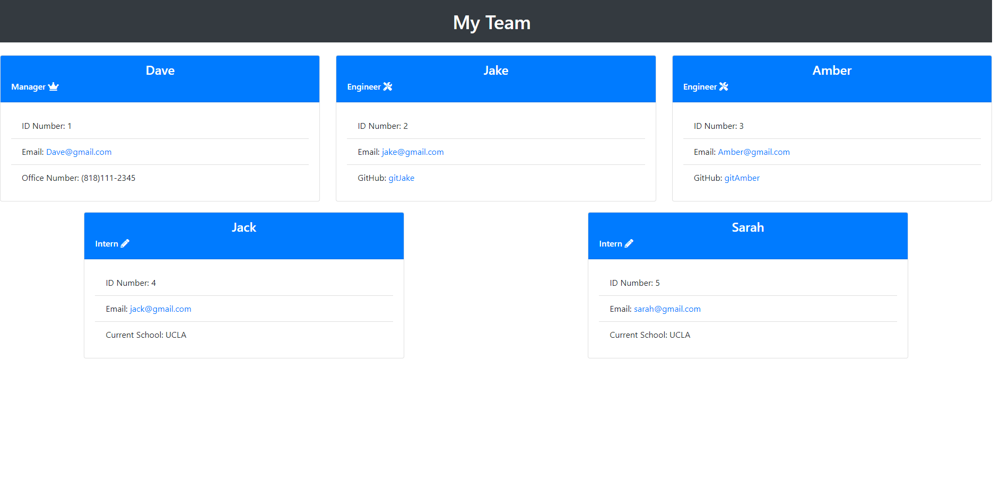

# 10-Team-Profile-Generator

## Table of Contents
  * [Purpose](#purpose)
  * [Built With](#built-with)
  * [Tests](#tests)
  * [Screenshot](#screenshot)
  * [Links](#links)

## Purpose
To create a Team profile generator that gives the team's basic information such as their roles and some basic contact information for each individual in the team. This project uses npm inquirer, jest, Node, and JavaScript

## Built-With
- Node
- JavaScript 

## Tests
- Tested with Jest for the classes in the lib folder 

## Screenshot
Screenshot of a sample HTML page

## Links
Links to Video DEMO and Sample README
Video DEMO: https://drive.google.com/file/d/1lkM6pXoIFK4rdU_agH313IbVfKMy6m6a/view   
Sample README: https://jcc83267.github.io/10-Team-Profile-Generator/dist/index.html  
